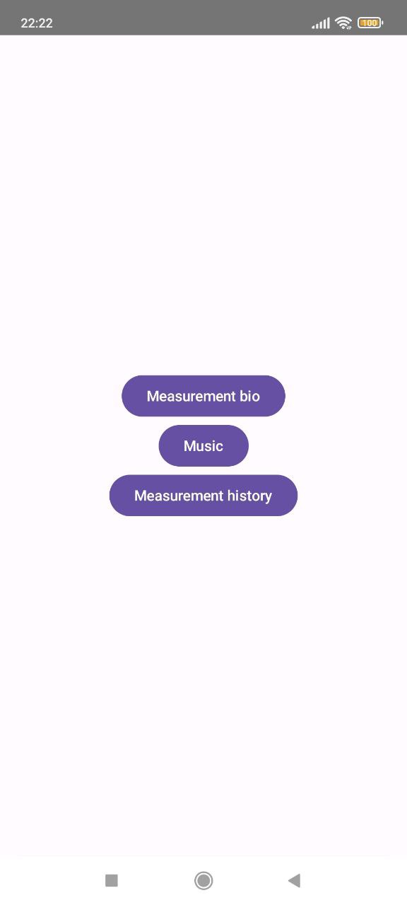
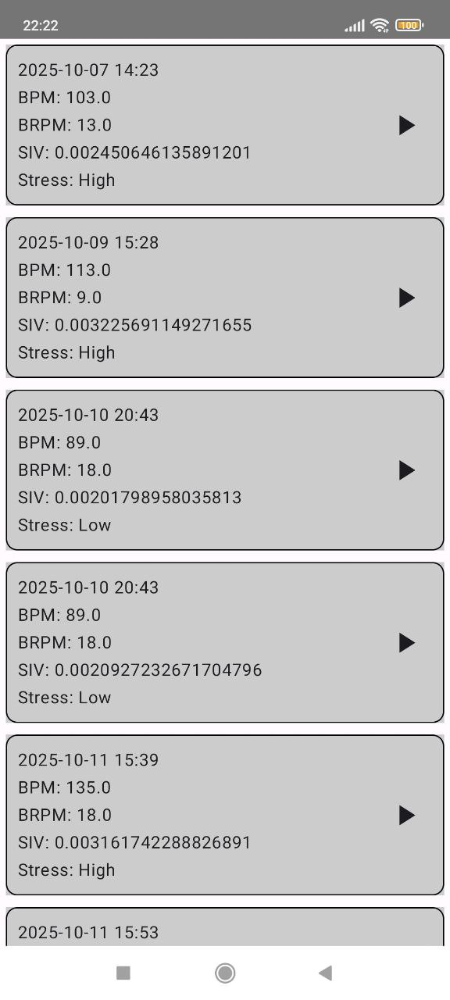
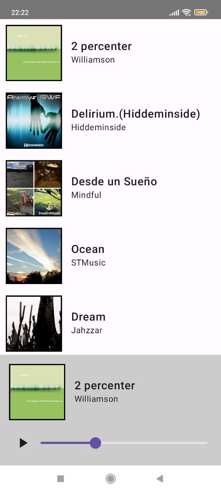

# MeditationBio

**MeditationBio** is an Android application that analyzes user's physiological signals and selects meditation music to reduce stress levels.  
The app measures three parameters:  
- **Heart rate** — via the camera using the PPG (Photoplethysmography) method  
- **Breathing rate** — via the device accelerometer  
- **Voice fluctuations** — via the microphone  

Based on these measurements, the app calculates the **overall stress level** and plays suitable **relaxation music**.

---

## Features

- Measure **heart rate**, **breathing rate**, **voice fluctuations**
- Calculate **overall stress level**
- Select **meditation music** based on analysis
- Store measurements history in a local database
- View past results
- Modern and intuitive UI built with **Jetpack Compose**

---

## Tech Stack

- **Kotlin**
- **MVVM + Clean Architecture**
- **Coroutines**
- **Room Database**
- **Retrofit**
- **Jetpack Compose**
- **Hilt (DI)**
- **ViewModel**
- **CameraX / Sensor APIs / MediaRecorder**

---

## Architecture

The project follows **MVVM architecture** with clear separation of concerns:

```
presentation/   -> UI, Jetpack Compose, ViewModel
domain/         -> business logic, use cases
data/           -> data sources (Room, Retrofit)
di/             -> Hilt dependency modules
```

This structure ensures:
- Easy unit testing of business logic  
- Scalable and maintainable code  
- Flexibility to add new data sources or screens  

---

## Installation & Run

1. Clone the repository:
   ```bash
   git clone https://github.com/KostyaHopaitsa/MeditationBioRefactoring
   ```
2. Open the project in **Android Studio**.
3. Make sure you have:
   - **Android Studio Giraffe+**
   - **JDK 17+**
   - **Android SDK 33+**
4. Sync Gradle:
   ```
   File → Sync Project with Gradle Files
   ```
5. Run the app on an emulator or physical device:
   ```
   Run → Run 'app'
   ```

---

## Screenshots

| Main Screen                    | Measurement Screens           | History Screen                       | Music Screen                     |
|--------------------------------|-------------------------------|--------------------------------------|----------------------------------|
|   |    |   |   |
| ------------------------------ |  | ------------------------------------ | -------------------------------- |
| ------------------------------ |    | ------------------------------------ | -------------------------------- |

---              

## Project Status

* Core functionality completed.  
* Further improvements and algorithm optimization planned.

---

## Author

**Kostiantyn Hopaitsa**  
Android Developer | Kotlin, Jetpack Compose, MVVM + Clean Architecture, Coroutines, Retrofit, Room, Hilt 
[LinkedIn](https://www.linkedin.com/in/kostya-hopaitsa-962a87397/) • [GitHub](https://github.com/KostyaHopaitsa)
